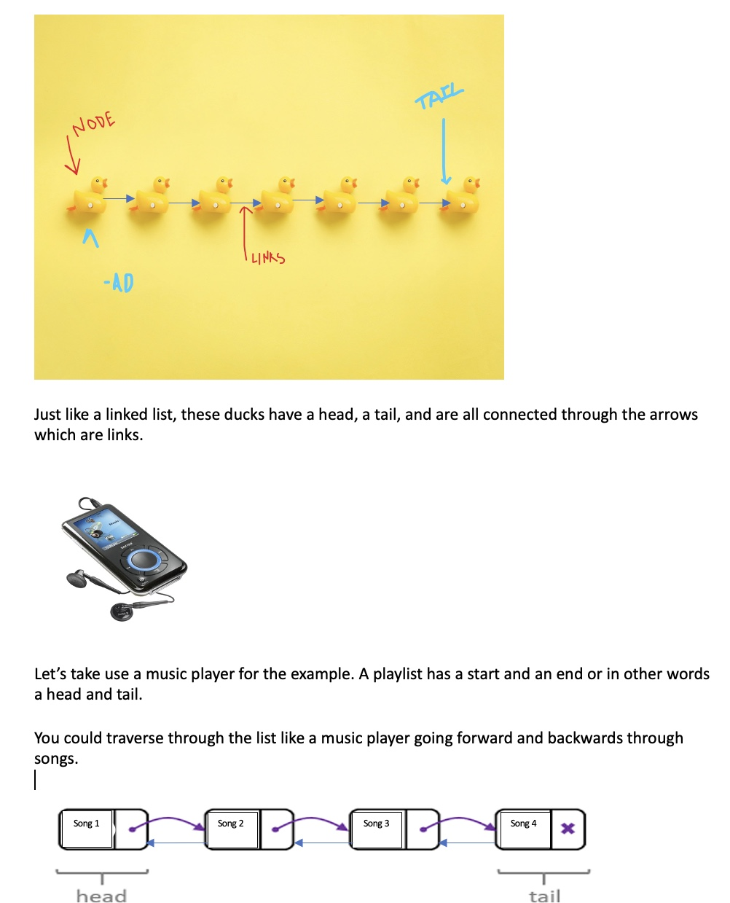

# Linked Lists
- [Back to welcome page](https://github.com/MarisabelTrejo/data-structure/blob/main/Welcome.md)

## Introduction
Each item is in a dynamic array is next to an item in memory. This data structure allows quick access to items in the list.
**Nodes and Pointers**: Each **element** is a **node** and inside the **node** it will contain a **value**. The link is an arrow pointing to the next node in the list
### Removing and Inserting: 
**4 STEP process**
1.	Create a new node
2.	Set “next”of the new node to the current head
3.	Set prev of the current head to the new node
4.	Set the head to equal to the new node

## Examples

## Big O Notation
When adding a new node or element in the beginning of the list, we perform a single operation and Big O will be constant time, or Big O(1), similar to removing a node. The only part that would be O(n) is when we are inserting or adding to the middle of the list.

## Lets Work Together 
Lets make a linked list together. We will practice inserting and removing steps from the recipe.

## Problem to Solve
Pretend you are updating your playlist and going through songs that you don't listen to anymore.
Practice how we can remove from the middle of your playlist.

