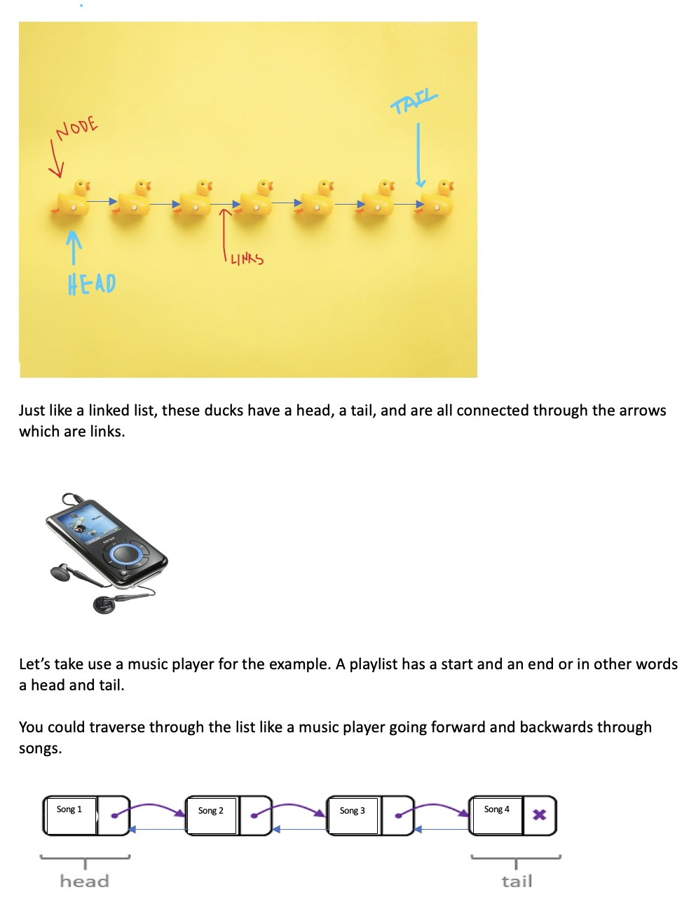

# Linked Lists
- [Back to welcome page](https://github.com/MarisabelTrejo/data-structure/blob/main/Welcome.md)

## Introduction
Each item is in a dynamic array is next to an item in memory. This data structure allows quick access to items in the list.
**Nodes and Pointers**: Each **element** is a **node** and inside the **node** it will contain a **value**. The link is an arrow pointing to the next node in the list
### Removing and Inserting: 
**4 STEP process**
1.	Create a new node
2.	Set “next”of the new node to the current head
3.	Set prev of the current head to the new node
4.	Set the head to equal to the new node

## Examples

