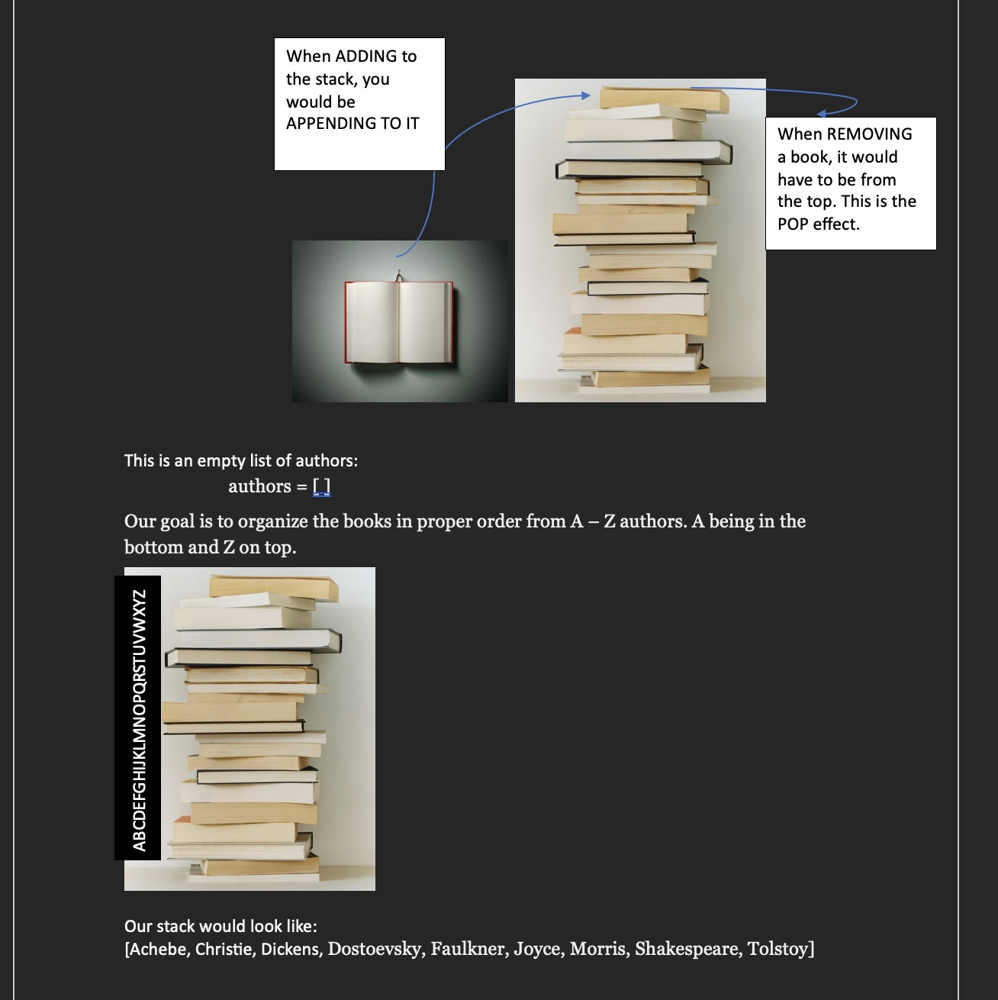

# Stacks
- [Back to Welcome Page](Welcome.md)
Stack follows the principle of first one in, last one out. The stack can be used to accomplish various tasks and can be implemented using a Python list.
**Pop and Push**: Each time we add something to the stack we **push**or in other words **“Append”**. Each time we remove from the stackwe **pop** it off or in other words **“Remove”**.

## Big O Notation
Big O Analysis - **O(1) Constant**
pop()
peek()
size()
isEmpty()
push()

## Example

 - [Together Walkthrough](stacks_tutorial.py)

## Problem to Solve
Lets pretend we are putting the books back but come to find out that we are accidently starting with authors that start with A insteand of Z.
How would we reverse the order of these auothors without breaking the stack? This will a challenge problem for you to solve.

- [Problem to Solve](stack_problem.py)

